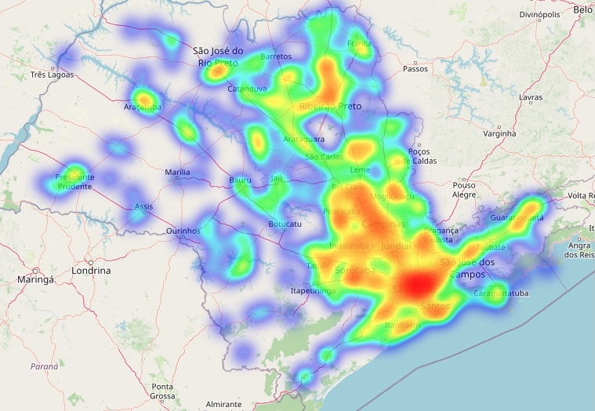
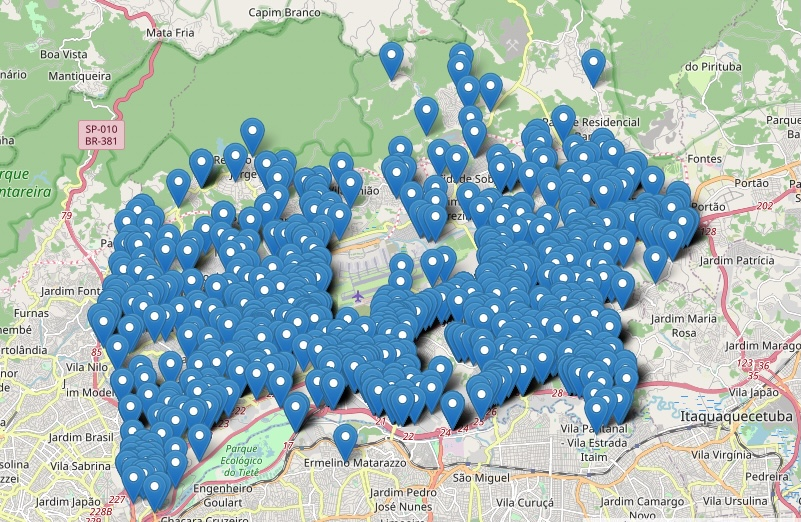

# Análise exploratória de dados dos roubos de veículos no Estado de São Paulo.

O objetivo desse estudo é entender aonde acontecem roubos de veículos no Estado de São Paulo e suas variáveis como:
    <ul>
    <li>Dia da semana</li>
    <li>Marcas e modelos</li>
    <li>Tipo de local</li>
    <li>Vítimas fatais</li>
    <li>Período dos roubos</li>
    <li>Etc</li>
    </ul>
    
Arquivo principal com o processo completo: <a href="https://github.com/data-science101/eda-roubos-veiculos-estado-sao-paulo/blob/main/main.ipynb">main.ipynb</a>

Os mapas gerados pelo Folium não são interativos e não aparecem no GitHub, caso queira navegar no mapa, utilize este <a href="https://nbviewer.org/github/data-science101/eda-roubos-veiculos-estado-sao-paulo/blob/main/main.ipynb">link</a>.

<h2>Mapas:</h2>

Mapa de calor de roubos de veículos no Estado de São Paulo:

Locais de roubos de veículos em Guarulhos:

